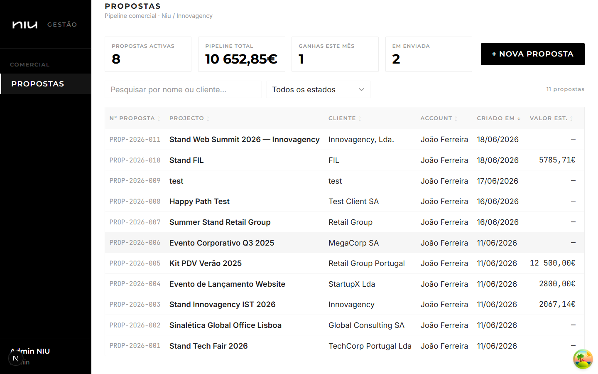
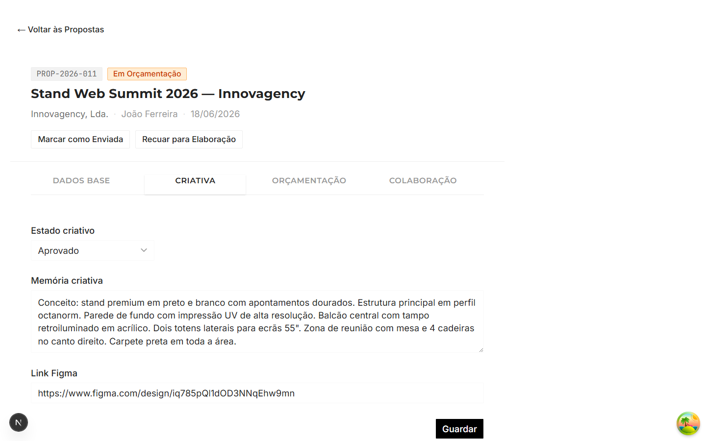
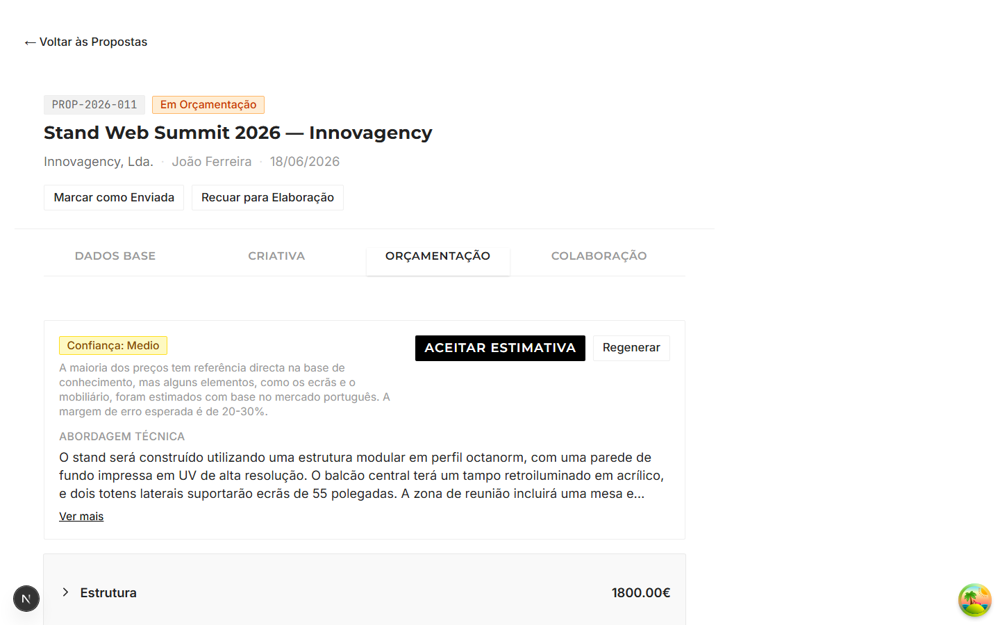
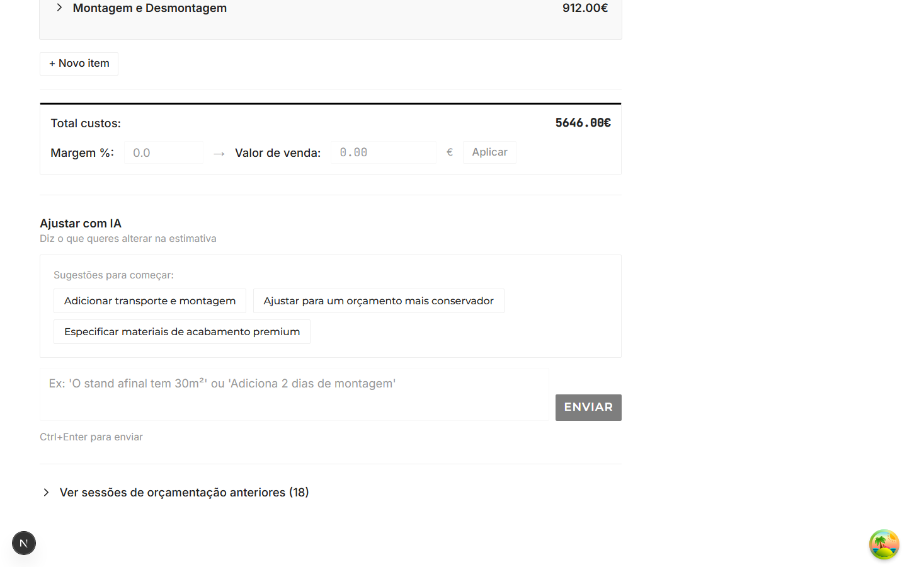
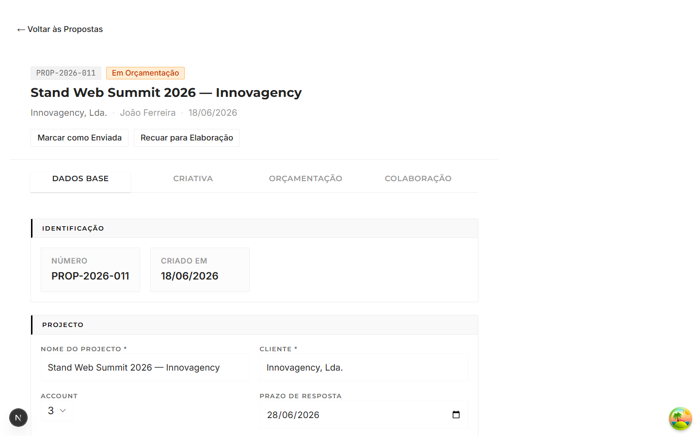
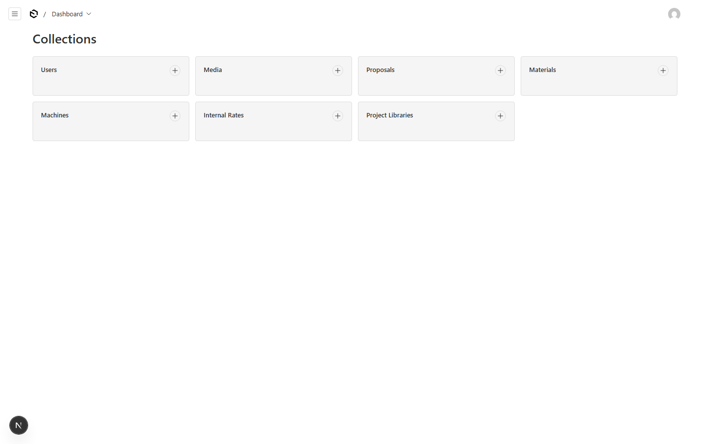
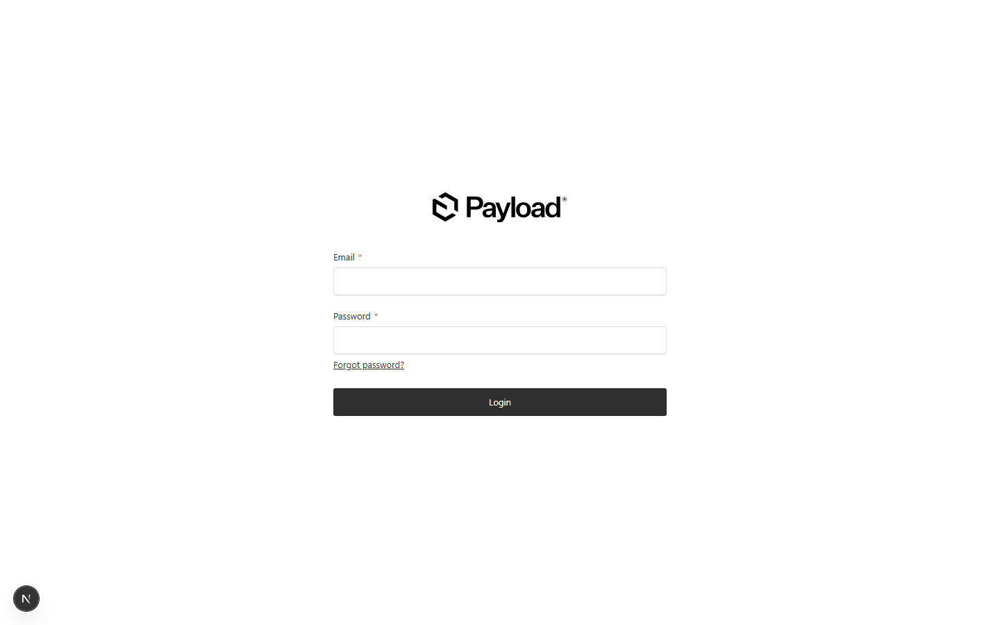

# NIU — Proposal Management System


## Overview

Niu is a brand activation and physical production agency specialising in stands, totems, signage, and event installations. This system digitises the full commercial proposal lifecycle — from intake to win/loss — replacing a manual, spreadsheet-based process. The differentiating feature is AI-assisted budgeting: GPT-4o Vision analyses mockup images to extract dimensions and materials, then GPT-4o generates a structured cost estimate covering every stage from raw materials to on-site installation and dismantling. Built as a working prototype focused on the commercial module.

## Screenshots

<table>
<tr>
<td width="50%">

**Proposals list with KPI cards**


</td>
<td width="50%">

**Proposal detail — Base Data tab**


</td>
</tr>
<tr>
<td width="50%">

**Creative Zone — creative memory and Figma link**


</td>
<td width="50%">

**Budgeting tab — AI estimate with confidence level**


</td>
</tr>
<tr>
<td width="50%">

**AI chat for iterative estimate refinement**


</td>
<td width="50%">

**State transition controls**


</td>
</tr>
<tr>
<td width="50%">

**Payload CMS admin — knowledge base management**


</td>
<td width="50%">

**Login**


</td>
</tr>
</table>

## Key Features

- **6-state proposal workflow** — Recebida → Em Elaboração → Em Orçamentação → Enviada → Ganha / Perdida, with immutable state machine and regression paths
- **Role-based access** — 4 roles (account, criativo, producao, admin) with field-level permissions; creative zone locked to creatives, budgeting locked to production
- **AI budgeting** — GPT-4o generates a structured cost estimate from briefing, creative memory, mockup descriptions, attached files, and Figma designs
- **GPT-4o Vision** — analyses mockup images and attached documents to extract visible dimensions, materials, structural elements, and finishes
- **Iterative AI chat** — full conversation history per budgeting session; user refines estimate by chatting with the AI in natural language
- **Deterministic AI** — `temperature: 0` + `seed: 42` on all GPT-4o calls for consistent, repeatable estimates
- **Document reading** — PDF text extraction (pdf-parse) + image attachments passed to Vision; Figma files fetched via REST API and analysed frame by frame
- **Auto proposal numbering** — PROP-YYYY-NNN format, sequential per year, generated in a beforeChange hook
- **Immutable activity log** — every state change, file upload, and comment recorded append-only per proposal
- **Knowledge base admin** — materials (with unit cost), machines, internal hourly rates, and historical project library, all managed in the Payload admin UI and used as AI context

## Tech Stack

| Layer | Technology | Why |
|---|---|---|
| Framework | Next.js 15 (App Router) | Server Components + Route Handlers in one deploy |
| CMS / Backend | Payload CMS 3 | Collections, hooks, access control, and admin UI built-in — runs inside Next.js |
| Database | PostgreSQL 16 | Managed by Payload's DB adapter; never manipulated directly |
| AI — Text | GPT-4o via OpenAI SDK | Structured JSON estimate generation with deterministic output |
| AI — Vision | GPT-4o Vision via OpenAI SDK | Mockup image and document analysis |
| UI | Shadcn/UI + Tailwind CSS | Accessible component primitives with a custom NIU brand theme |
| Client State | TanStack Query | Cache, refetch, and loading states for all browser→server calls |
| File Storage | Cloudflare R2 (S3-compatible) | Via `@payloadcms/storage-s3` — local storage in development |
| Auth | Payload built-in | Email + password; session cookie; role checked on every request |

## Architecture

```
Browser (React Client Components)
        ↕  REST API  /api/proposals/[id]/...
Next.js App Router + Payload CMS 3
        ↕  Payload Local API (no HTTP, direct function call)
PostgreSQL
        ↕
Cloudflare R2       GPT-4o (text)       GPT-4o Vision
```

- Payload runs **inside** Next.js — one deploy, shared TypeScript types generated automatically
- AI calls happen in **afterChange hooks**, not triggered directly by the frontend; fire-and-forget so they don't block the HTTP response
- The budgeting session is a **persistent GPT-4o conversation** with full message history stored per session in the proposals collection
- Each transition to *Em Orçamentação* creates a **new session** — previous sessions are kept for history

## AI Integration — Generation Flow

1. Proposal advances to *Em Orçamentação* — `afterChange` hook fires
2. Hook re-fetches the proposal with `depth: 2` to populate all media relations
3. Knowledge base fetched from DB — materials, machines, internal rates, project library
4. Mockup images downloaded → converted to base64 → GPT-4o Vision → text description
5. Attached files processed — PDFs text-extracted via pdf-parse; images sent to Vision
6. Figma link (if present) — frames exported as PNG via Figma REST API; text nodes extracted recursively
7. `buildPrompt` assembles all sources into a single structured user message with a 10-point mandatory self-audit checklist
8. GPT-4o receives the system prompt (`estimateSystem.ts`) + assembled user message
9. GPT-4o returns pure JSON: `abordagem_tecnica`, `nivel_confianca`, and `estimativa` with grouped line items
10. JSON validated, saved to `sessaoOrcamentacao`; frontend renders editable estimate table

**Iterative refinement** — the user can adjust the estimate by chatting with GPT-4o in natural language ("increase stand to 30m²", "add external equipment rental"). The full conversation history is resent with each message and GPT-4o returns an updated JSON estimate.

## Project Structure

```
src/
├── app/
│   ├── (frontend)/
│   │   ├── propostas/
│   │   │   ├── page.tsx                    — Proposals list (A01)
│   │   │   └── [id]/page.tsx               — Proposal detail (A02)
│   │   ├── globals.css
│   │   └── layout.tsx
│   ├── (payload)/admin/                    — Payload admin UI (auto)
│   └── api/proposals/[id]/
│       ├── transition/route.ts             — State transitions
│       ├── chat/route.ts                   — AI iterative chat
│       └── estimate/accept/route.ts        — Accept estimate
├── collections/
│   ├── Proposals.ts                        — Central collection (full schema)
│   ├── Users.ts                            — 4-role auth
│   ├── Materials.ts                        — AI knowledge base
│   ├── Machines.ts                         — Machine inventory
│   ├── InternalRates.ts                    — Hourly labour costs
│   └── ProjectLibrary.ts                   — Historical project benchmarks
├── hooks/
│   ├── beforeChange/
│   │   ├── validateTransition.ts           — State machine enforcement
│   │   └── generateProposalNumber.ts       — PROP-YYYY-NNN
│   └── afterChange/
│       ├── generateEstimate.ts             — AI trigger on EmOrcamentacao
│       └── logActivity.ts                  — Append-only activity log
├── lib/
│   ├── ai/
│   │   ├── claudeClient.ts                 — GPT-4o estimate generation
│   │   ├── openaiClient.ts                 — GPT-4o Vision image analysis
│   │   ├── buildPrompt.ts                  — Assembles all sources into prompt
│   │   ├── readAttachments.ts              — PDF extraction + attachment images
│   │   ├── generateEstimateForProposal.ts  — Orchestrates full generation flow
│   │   ├── parseEstimate.ts                — JSON validation
│   │   └── prompts/estimateSystem.ts       — AI system prompt (PT-PT)
│   └── figma.ts                            — Figma REST API integration
├── components/
│   ├── proposals/
│   │   ├── ProposalTable.tsx
│   │   ├── ProposalKPIs.tsx
│   │   ├── ProposalFilters.tsx
│   │   ├── StateSelector.tsx
│   │   ├── EstimateEditor.tsx
│   │   ├── EstimateChat.tsx
│   │   ├── ActivityLog.tsx
│   │   └── tabs/
│   │       ├── TabDadosBase.tsx
│   │       ├── TabCriativa.tsx
│   │       ├── TabOrcamentacao.tsx
│   │       └── TabColaboracao.tsx
│   └── ui/                                 — Shadcn/UI components
├── payload.config.ts
└── seed.ts
```

## Getting Started

```bash
git clone https://github.com/lourencosilvabeato/Sistema-NIU.git
cd Sistema-NIU
npm install
cp .env.example .env.local
# fill in DATABASE_URI and OPENAI_API_KEY at minimum
```

Start PostgreSQL (Docker):

```bash
docker run -d --name niu-db \
  -e POSTGRES_DB=sistema-niu \
  -e POSTGRES_PASSWORD=yourpassword \
  -p 5432:5432 postgres:16
```

Run migrations and seed:

```bash
npm run payload migrate
npm run seed
npm run dev
```

Open [http://localhost:3000/propostas](http://localhost:3000/propostas)

### Test Credentials

| Role | Email | Password |
|---|---|---|
| Admin | admin@niu.pt | test1234 |
| Account | account@niu.pt | test1234 |
| Criativo | criativo@niu.pt | test1234 |
| Producao | producao@niu.pt | test1234 |

## Environment Variables

| Variable | Required | Description |
|---|---|---|
| `DATABASE_URI` | Yes | PostgreSQL connection string |
| `PAYLOAD_SECRET` | Yes | Payload secret — min 32 chars |
| `OPENAI_API_KEY` | Yes (for AI) | GPT-4o text + vision |
| `FIGMA_API_TOKEN` | No | Figma REST API — enables Figma file analysis |
| `CLOUDFLARE_R2_BUCKET` | No | R2 bucket — local storage used in development |
| `CLOUDFLARE_R2_ACCESS_KEY` | No | R2 access key |
| `CLOUDFLARE_R2_SECRET_KEY` | No | R2 secret key |
| `CLOUDFLARE_R2_ENDPOINT` | No | `https://<id>.r2.cloudflarestorage.com` |
| `RESEND_API_KEY` | No | Transactional email (optional in prototype) |
| `NEXT_PUBLIC_SERVER_URL` | Yes | `http://localhost:3000` in development |

See `.env.example` for a complete template.

## Scope and Roadmap

**This prototype covers the commercial module:**
- Proposal intake, creative development, AI-assisted budgeting, commercial approval, win/loss tracking

**Planned — production module (out of scope for prototype):**
- Automatic project creation when a proposal is marked as *Ganha*
- Production orders (OTs), purchase orders (OCs), fabrication orders (OFs)
- Task distribution by department (creativo, produção, montagem)
- Project timelines and resource scheduling

## Development Approach

- Architected with [Claude](https://claude.ai) as a thinking partner — system design, collection schema, state machine, AI prompt engineering
- Implemented with [Claude Code](https://claude.ai/code) using `CLAUDE.md` as persistent project context across sessions
- `PROMPTS.md` guided sequential, feature-by-feature implementation
- Structured git commits per feature with 10 logical feature branches for full traceability
- AI calls use `temperature: 0` + `seed: 42` throughout — deterministic, reproducible estimates
